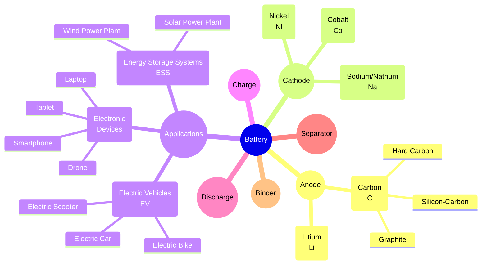
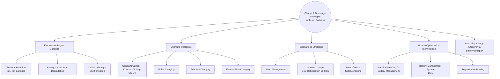

Task 1 | 
:-: | 
Mind Map | 

```mermaid
mindmap
root((Battery))
 ((Anode))
  (Carbon<br>C)
   Graphite
   Silicon-Carbon
   Hard Carbon
  (Litium<br>Li)
 ((Cathode))
  (Nickel<br>Ni)
  (Cobalt<br>Co)
  (Sodium/Natrium<br>Na)
 ((Applications))
  (Electric Vehicles<br>EV)
   Electric Car
   Electric Bike
   Electric Scooter
  (Electronic<br>Devices)
   Smartphone
   Tablet
   Laptop
   Drone
  (Energy Storage Systems<br>ESS)
   Solar Power Plant
   Wind Power Plant
 ((Charge))
 ((Discharge))
 ((Separator))
 ((Binder))
```

Task 2 | 
:-: | 
Concept Map | 

```mermaid
graph 
%%nodes connections
A --> B
    A --> C
    A --> D
    A --> E
    A --> F

    B --> B1[Chemical Reactions<br>in Li-Ion Batteries]
    B --> B2[Battery Cycle Life & Degradation]
    B --> B3[Lithium Plating &<br>SEI Formation]

    C --> C1[Constant Current –<br>Constant Voltage<br>CC-CV]
    C --> C2[Pulse Charging]
    C --> C3[Adaptive Charging]
    C --> C4[Fast vs Slow Charging]

    D --> D1[Load Management]
    D --> D2[State of Charge<br>SoC Optimization 20-80%]
    D --> D3[State of Health<br>SoH Monitoring]

    E --> E1[Machine Learning for<br>Battery Management]
    E --> E2[Battery Management System<br>BMS]
    E --> E3[Regenerative Braking]
%%nodes definition
A((Charge & Discharge Strategies<br>for Li-Ion Batteries))
B[Electrochemistry of Batteries]
C[Charging Strategies]
D[Discharging Strategies]
E[Modern Optimization Technologies]
F[Improving Energy Efficiency &<br>Battery Lifespan]
```
